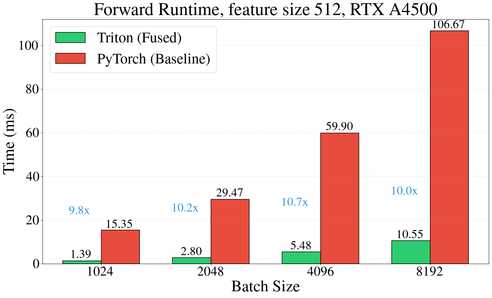
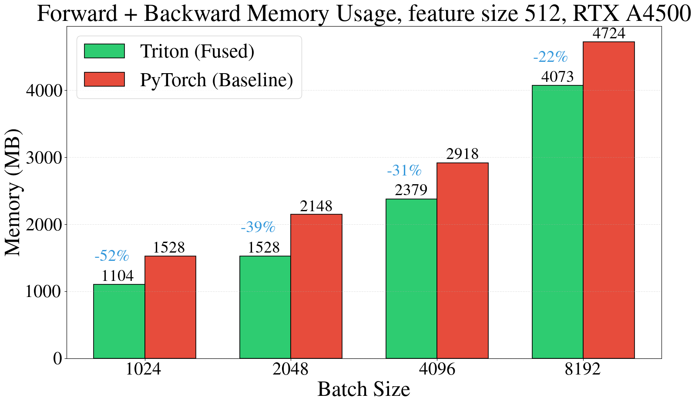

<div align="center">

# Flash Clifford


</div>

Flash Clifford provides optimized Triton implementations of weighted geometric product and fully connected geometric product for 2D and 3D Euclidean spaces.
The implementation fuses GELU activation, fully-connected geometric products, and grade-wise RMSNorm into few kernel operations, achieving significant speedups and memory savings over baseline PyTorch implementations that employs matrix multiplication. The spedup is achieved by manually encoding geometric product rules in forward and backward passes, which otherwise is done via multiplication with a sparse matrix (85-99% sparse depending on the dimensionality).

## Performance

Flash Clifford achieves **~10x speedup** and **22-52% memory reduction** compared to PyTorch baseline (both torch compiled):

<table>
<tr>
<td width="50%">



</td>
<td width="50%">



</td>
</tr>
</table>


## Installation

```bash
git clone https://github.com/maxxxzdn/flash-clifford.git
cd flash-clifford
uv pip install torch triton
```

## Usage

```python
import torch
from ops.fc_p3m0 import FullyConnectedGeluGeometricProductNorm3D

# Input: multivectors of shape (batch, features, 8)
x = torch.randn(4096, 512, 8).cuda()
y = torch.randn(4096, 512, 8).cuda()
weight = torch.randn(20, 512, 512).cuda()

# GELU -> Fully connected geometric product -> grade-wise RMSNorm
output = FullyConnectedGeluGeometricProductNorm3D.apply(
    x, y, weight, normalize=True
)
```

## Benchmarking

Run benchmarks with:

```bash
python tests/benchmarks/fc_p3m0.py
```

## Testing

Verify correctness against PyTorch baseline:

```bash
python tests/fc_p3m0.py
```