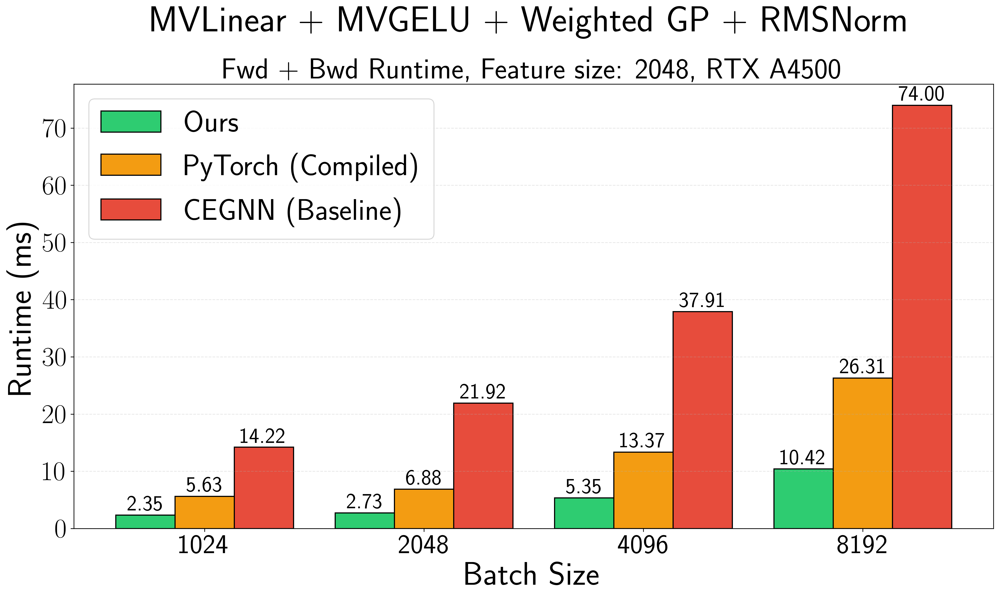

<div align="center">

# Flash Clifford


</div>

`flash-clifford` provides optimized Triton implementations of weighted geometric product and fully connected geometric product for 2D and 3D Euclidean spaces.
The implementation fuses GELU activation, fully-connected/weighted geometric products, and grade-wise RMSNorm into few kernel operations, achieving significant speedups and memory savings over baseline PyTorch implementations that employs matrix multiplication. The speedup is achieved by manually encoding geometric product rules in forward and backward passes, which otherwise is done via multiplication with a sparse matrix (85-99% sparse depending on the dimensionality).

## Performance

Flash Clifford achieves **~10x speedup** and **22-52% memory reduction** compared to [PyTorch baseline](https://github.com/DavidRuhe/clifford-group-equivariant-neural-networks/blob/8482b06b71712dcea2841ebe567d37e7f8432d27/models/nbody_cggnn.py#L47). By switching the memory layout to `(MV_DIM, B, N)`, we are able to get significant speedup of [Clifford algebra MLP](https://github.com/DavidRuhe/clifford-group-equivariant-neural-networks/blob/8482b06b71712dcea2841ebe567d37e7f8432d27/models/nbody_cggnn.py#L47):

<div align="center">



</div>


## Installation

```bash
git clone https://github.com/maxxxzdn/flash-clifford.git
cd flash-clifford
uv pip install torch triton
```

## Usage

```python
import torch
from modules.layer import Layer

# Input: multivectors in 3D of shape (8, batch, features)
x = torch.randn(8, 4096, 512).cuda()

# Linear layer: grade-wise linear + weighted GP
layer = Layer(512, dims=3, normalize=True, use_fc=False).cuda()

output = layer(x)
```

## Benchmarking

Run benchmarks with:

```bash
python tests/benchmarks/fc_p3m0.py
```

## Testing

Verify correctness against PyTorch baseline:

```bash
python tests/fc_p3m0.py
```