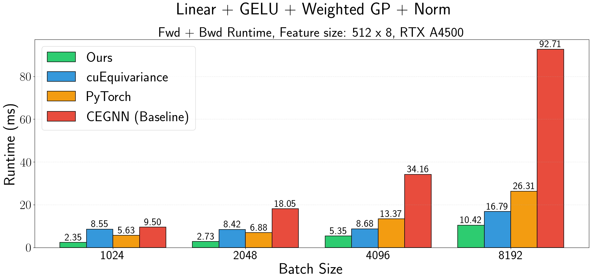
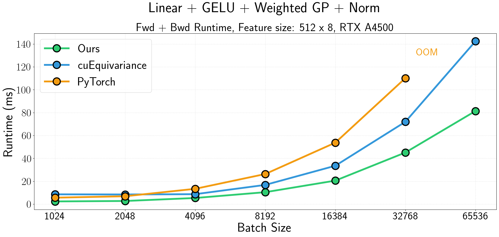

<div align="center">

# Flash Clifford
`flash-clifford` provides efficient Triton-based implementations of Clifford algebra-based models. 


</div>

## $O(n)$-Equivariant operators
The list of currently implemented $O(2)$- and $O(3)$-equivariant operators:
- `fused_gelu_sgp_norm_nd`: multivector GELU $\rightarrow$ weighted geometric product $\rightarrow$ (optionally) multivector RMSNorm
- `fused_gelu_fcgp_norm_nd`: multivector GELU $\rightarrow$ fully connected geometric product $\rightarrow$ (optionally) multivector RMSNorm
- `linear layer`: multivector linear $\rightarrow$ `fused_gelu_sgp_norm_nd`

Any suggestions for different operators are welcome :)

## Primer on Clifford Algebra
Clifford algebra is tightly connected to the Euclidean group $E(n)$. That is, elements of Clifford algebra are **multivectors** - stacks of basis components (scalar, vector, etc.). Those components correspond 1:1 to irreducible representations of $O(n)$. For example, for 3D:

| Grades           | Irreps |
|------------------|--------|
| 0 (scalar)       | 0e     |
| 1 (vector)       | 1o     |
| 2 (bivector)     | 1e     |
| 3 (trivector)    | 0o     |

The **geometric product** is a bilinear operation that takes two multivectors and returns a multivector, essentially mixing information between grades equivariantly ([Ruhe et al., 2023](https://arxiv.org/abs/2305.11141)). It is a subset of the tensor product, with the key difference that the geometric product does not generate higher-order representations (e.g., frequency 2). While this might come across as a limitation in terms of expressivity, the fixed and simple structure of the geometric product admits very efficient computation, which can be implemented in approx. ~1k LOC (compared to 10k LOC in [cuEquivariance](https://github.com/NVIDIA/cuEquivariance)). Empirically, Clifford algebra-based neural networks achieve state-of-the-art performance on [N-body tasks](https://arxiv.org/abs/2305.11141) and [jet tagging](https://arxiv.org/abs/2405.14806). At the same time, they are undeservedly dismissed for their inefficiency, which we aim to address in this repo :).

## Performance
### Our approach
The baseline approach taken in [Ruhe et al., 2023](https://github.com/DavidRuhe/clifford-group-equivariant-neural-networks) is to implement the geometric product via dense einsum `bni, mnijk, bnk -> bmj`, where `mnijk` is a tensor (Cayley table) that encodes how the interaction of element `i` of multivector 1 and element `k` of multivector 2 results in element `j` of the output multivector. This allows having a single out-of-the-box implementation for any metric space, which is definitely cool, but it suffers in performance as the Cayley table is extremely sparse (85% in 2D, 95% in 3D). Thus, we mainly improve performance by simply hardcoding the rules of the geometric product, eliminating wasteful operations. The second source of optimization comes from fusing multiple kernels into one, specifically the activation function, which typically comes before the geometric product, and normalization. Finally, significant speedup is achieved by switching to `(MV_DIM, BATCH_SIZE, NUM_FEATURES)` memory layout, which allows expressing the linear layer as batch matmul.

### Benchmarking
To demonstrate performance improvements, we benchmark the following linear layer:
```
input: multivector features x, GP weights w
1) y = MVLinear(x)
2) x = MVGELU(x)
3) y = MVGELU(y)
4) o = weighted_gp(x, y, w)
5) o = MVRMSNorm(o)
```
which is a primitive of a [Clifford Algebra MLP](https://github.com/DavidRuhe/clifford-group-equivariant-neural-networks/blob/8482b06b71712dcea2841ebe567d37e7f8432d27/models/nbody_cggnn.py#L47).
We compare against `cuEquivariance` (using the correspondence between multivectors and irreps) and the baseline CEGNN implementation, achieving significant improvements:

<div align="center">


</div>


## Requirements
The following requirements must be satisfied:
- PyTorch
- Triton >= 3.0

If you want to run tests, additionally:
- NumPy
- matplotlib


## Usage
```python
import torch
from modules.layer import Layer

# Input: multivectors in 3D of shape (8, batch, features)
x = torch.randn(8, 4096, 512).cuda()

# Linear layer: grade-wise linear + weighted GP
layer = Layer(512, dims=3, normalize=True, use_fc=False).cuda()

output = layer(x)
```

## Benchmarking

Run benchmarks (runtime + memory) with:
```bash
python -m tests.benchmarks.layer_3d
```
This will generate a heatmap comparison against a torch-compiled implementation, which can also be found in [results](/home/maxxxzdn/Deusex/fast_clifford/flash-clifford/tests/benchmarks/results) (done on RTX 4500).

## Testing

To verify correctness against a PyTorch baseline:
```bash
python -m tests.p3m0
```
which will check both forward and backward (gradient) passes as well as measure the runtime and memory consumption.

## Citation
If you find this repository helpful, please cite our work:
```
@software{flashclifford2025,
  title  = {Flash Clifford: Hardware-Efficient Implementation of Clifford Algebra Neural Networks},
  author = {Zhdanov, Maksim},
  url    = {https://github.com/maxxxzdn/flash-clifford},
  year   = {2025}
}
```